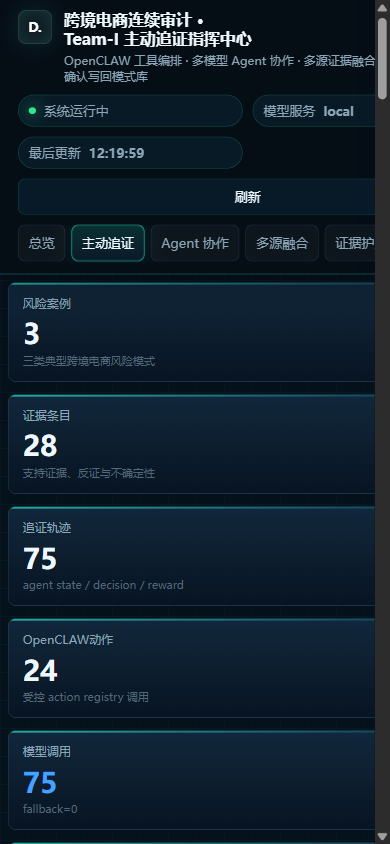

# Team-I OpenCLAW Audit Demo

Team-I is a competition demo for continuous audit in cross-border e-commerce. It combines OpenCLAW-style governed actions, multi-model agents, multi-source evidence fusion, active evidence retrieval, evidence passports, and human-approved pattern learning into one reproducible audit workflow.

> This repository is packaged for GitHub release. Model weights are intentionally excluded.

## Highlights

- **OpenCLAW action layer**: every audit operation is registered as a governed tool/action with typed parameters and structured observations.
- **Multi-model agent collaboration**: 7B role agents handle risk signals, assertions, routing, and investigation; 14B role agents handle pattern matching, evidence passport narrative, and pattern learning.
- **Active evidence retrieval**: cases are not closed after the first risk hit. The router repeatedly selects the next action based on missing evidence dimensions, counter-evidence needs, cost, and learned policy priors.
- **Multi-source fusion**: order, payment, refund, logistics, comments, device fingerprints, IP profiles, subsidy ledgers, gateway logs, and external fraud features are fused into an explainable evidence graph.
- **Evidence Passport**: each case produces support evidence, counter-evidence, uncertainty, a human-review gate, and replayable agent/action trajectories.
- **Pattern Learning loop**: candidate patterns can be approved by a human reviewer and written back to `risk_pattern`, `case_memory`, and `policy_action_weight`.
- **Demo UI**: a dark command-center frontend exposes dashboard, active trace playback, agent collaboration, fusion graph, evidence passport, and pattern-learning pages.

## Architecture

> **Architecture diagram placeholder**
>
> Insert the final Team-I architecture diagram here. Suggested content:
> data sources -> fusion engine -> risk cases -> multi-model agents -> OpenCLAW actions -> evidence graph -> evidence passport -> human review -> pattern/policy writeback.

## Screenshots

| Overview | Active evidence retrieval |
| --- | --- |
|  |  |

| Multi-source fusion | Pattern learning |
| --- | --- |
|  |  |

Mobile trace view:



## Repository Layout

```text
backend/
  app.py                         # FastAPI entry wrapper
  aer_loop/
    agents/                      # model-backed audit agents
    api/                         # FastAPI endpoints
    data/                        # synthetic scenario generator
    openclaw/                    # OpenCLAW-compatible contracts
    static/                      # demo frontend
    tools/                       # governed action registry
    db.py                        # SQLite schema and persistence
    fusion.py                    # multi-source fusion and graph logic
    llm_client.py                # fallback/local/OpenAI-compatible model client
    model_server.py              # OpenAI-compatible local model server
    orchestrator.py              # end-to-end audit loop
    policy.py                    # next-action ranking and learned priors
data/
  patterns/                      # seed risk patterns
docs/
  DEMO_SCRIPT.md                 # five-minute demo narrative
  IMPLEMENTATION_PLAN.md         # implementation plan
  VERIFICATION.md                # validation evidence and jobs
  assets/screenshots/            # UI screenshots for README
logs/                            # selected run summaries and Slurm outputs
materials/
  route_calibration_materials.tar.gz
openclaw/
  project_openclaw.json5
  agents.json5
  plugins/aer_audit_tools/       # OpenCLAW plugin scaffold
runtime/
  *.sqlite                       # reproducible demo databases, excluding model weights
scripts/
  *.sh / *.sbatch                # local, API, model, and Slurm runners
```

## Quick Start

The project was validated on HPC2 Linux with Python 3.11. A small deterministic fallback run can be executed without GPU; model-backed runs require local model paths or an OpenAI-compatible service.

```bash
python -m venv .venv
source .venv/bin/activate
pip install -r requirements.txt
export PYTHONPATH="$PWD/backend:${PYTHONPATH:-}"

# Smoke run without GPU-backed model inference
AER_MODEL_BACKEND=fallback python -m aer_loop.cli run --orders 4000 --max-steps 12
python -m aer_loop.cli summary
```

Start the API and frontend:

```bash
export PYTHONPATH="$PWD/backend:${PYTHONPATH:-}"
export AER_DB_PATH="$PWD/runtime/aer_loop_model_smoke_9728967_full_debug.sqlite"
export AER_MODEL_BACKEND=local
python -m uvicorn app:app --app-dir backend --host 127.0.0.1 --port 18083
```

Open:

```text
http://127.0.0.1:18083/
```

## Model Setup

Model weights are not committed. The validated HPC2 mapping was:

- 7B agents: `Qwen2.5-Coder-7B-Instruct`
- 14B agents: `Qwen2.5-Coder-14B-Instruct`

Set the paths before model-backed execution:

```bash
export AER_MODEL_BACKEND=local
export AER_MODEL_PATH=/path/to/Qwen2.5-Coder-7B-Instruct
export AER_MODEL_14B_PATH=/path/to/Qwen2.5-Coder-14B-Instruct
```

For OpenAI-compatible local serving:

```bash
bash scripts/serve_model.sh
export AER_MODEL_BACKEND=openai
export AER_OPENAI_BASE_URL=http://127.0.0.1:18080/v1
```

See [docs/VERIFICATION.md](docs/VERIFICATION.md) for the exact HPC2 validation jobs.

## Demo Data and Results

This repository includes synthetic scenario data and reproducible SQLite outputs:

- `data/patterns/*.yaml`: seed risk-pattern definitions.
- `runtime/aer_loop_model_smoke_9728967_full_debug.sqlite`: final local-model validated demo database.
- `runtime/pattern_learning_writeback_test.sqlite`: pattern learning writeback validation database.
- `logs/model_summary_*.json`: compact model-backed validation summaries.
- `logs/model_smoke_run_*.json`: selected full run outputs.

The large OpenAI-compatible SQLite database from job `9729073` is not committed because it exceeds GitHub's single-file limit after the current demo-service mutation history. Its compact validation summary is preserved under `logs/model_summary_9729073_openai_full_debug.json`.

## API Surface

Core endpoints:

- `GET /api/dashboard`
- `GET /api/cases`
- `GET /api/cases/{case_id}`
- `GET /api/cases/{case_id}/graph`
- `GET /api/cases/{case_id}/passport`
- `GET /api/cases/{case_id}/route`
- `POST /api/cases/{case_id}/step`
- `POST /api/cases/{case_id}/run`
- `POST /api/cases/{case_id}/review`
- `POST /api/patterns/candidates/{candidate_id}/review`
- `GET /api/policy/weights`
- `POST /api/openclaw/tools/{action_name}`

## Validation Snapshot

Latest final local-model validation:

```text
Slurm job: 9728967
Cases: 3
Evidence rows: 28
Trajectory rows: 75
Case-thread action rows: 24
Evidence passports: 3
Model invocations: 75
Fallback calls: 0
```

OpenAI-compatible model service validation:

```text
Slurm job: 9729073
Cases: 3
Evidence rows: 28
Trajectory rows: 75
Evidence passports: 3
Model invocations: 75 OpenAI-compatible HTTP calls
Fallback calls: 0
```

## Notes for GitHub Release

- `models/` is excluded by design.
- `node_modules/`, Python bytecode, API PID files, HPC service state, and oversized runtime files are excluded.
- Raw route-calibration materials are stored as `materials/route_calibration_materials.tar.gz` to avoid Windows path-encoding issues with Chinese filenames.
- The default publishing recommendation is a **private GitHub repository** until competition disclosure requirements are confirmed.
