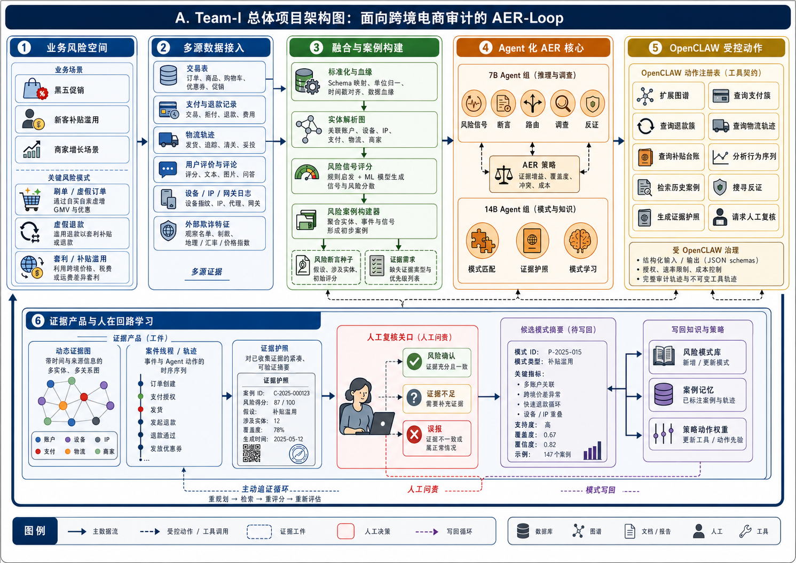
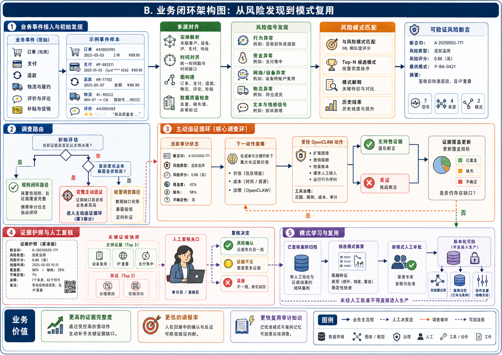
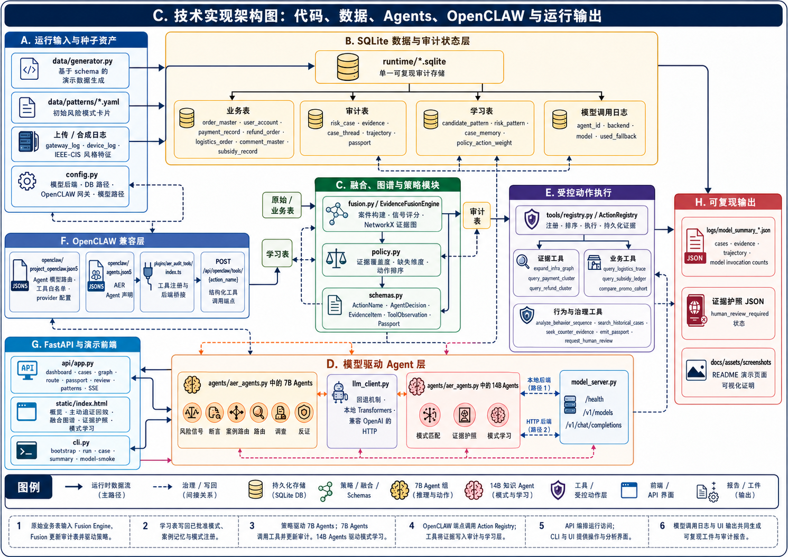
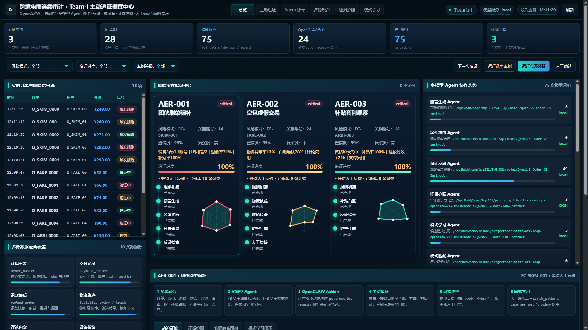
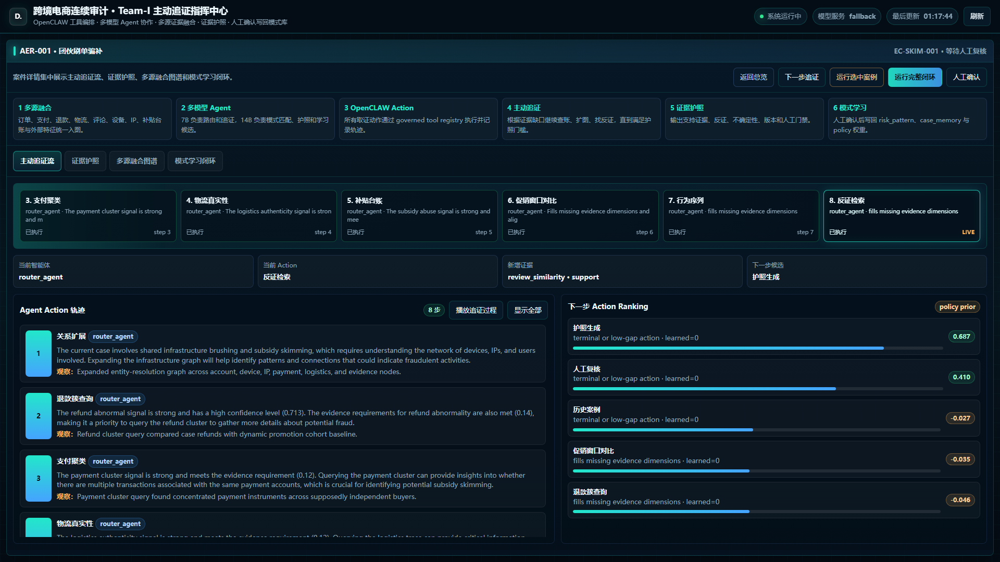
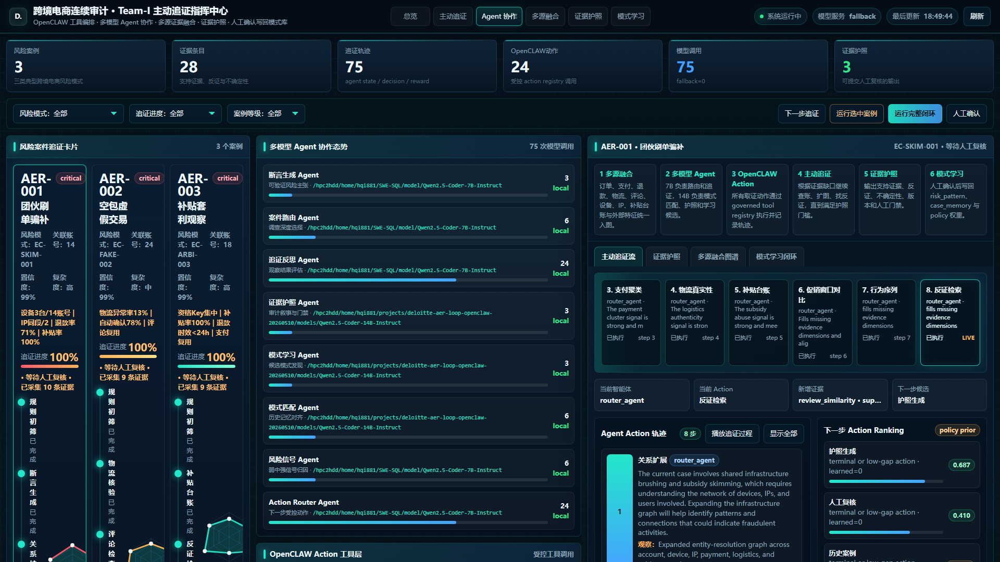
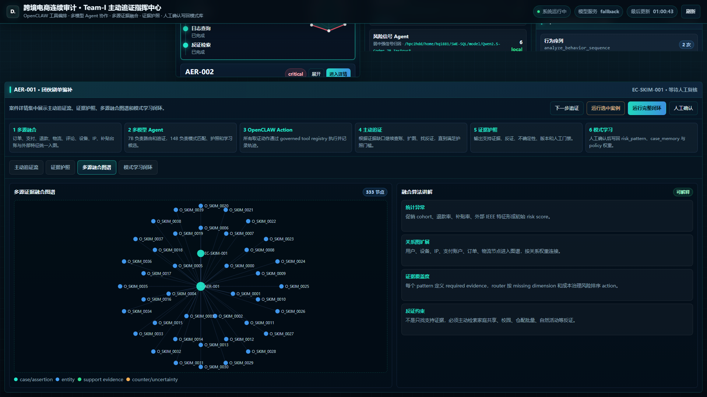
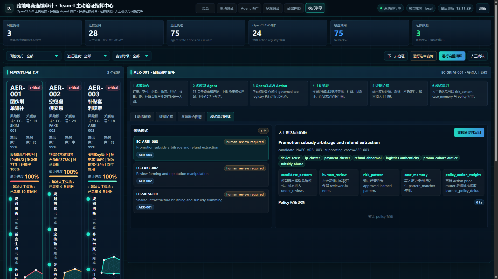
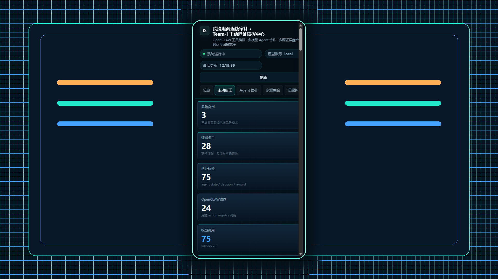

# Team-I OpenCLAW 主动追证审计演示系统

Team-I 是面向跨境电商连续审计场景的比赛演示系统。系统把 OpenCLAW 风格的受控动作、多模型智能体协作、多源证据融合、主动追证、证据护照和人工确认后的模式学习写回整合成一条可复现的审计闭环。

> 本仓库是面向 GitHub 发布整理后的版本。模型权重不会进入仓库，需要在运行环境中单独下载或挂载。

## 核心亮点

- **OpenCLAW 动作层**：每个审计动作都注册为受控工具，带有结构化参数、结构化观察结果和审计轨迹。
- **多模型智能体协作**：7B 模型承担风险信号、断言生成、案件路由、动作路由和追证反思；14B 模型承担模式匹配、证据护照叙事和候选模式学习。
- **主动追证闭环**：系统不会在第一次命中风险规则后直接结案，而是根据证据缺口、反证需求、成本、治理风险和学习到的策略权重持续选择下一步动作。
- **多源证据融合**：订单、支付、退款、物流、评论、设备指纹、IP 画像、补贴台账、网关日志和外部欺诈特征会被融合成可解释的证据图谱。
- **证据护照**：每个案件输出支持证据、反证、不确定性、人工复核门禁和可回放的智能体动作轨迹。
- **模式学习写回**：候选风险模式经过人工审核后，可以写回 `risk_pattern`、`case_memory` 和 `policy_action_weight`，后续路由会读取学习到的策略增量。
- **演示前端**：前端包含总览、主动追证播放、智能体协作、多源融合图谱、证据护照和模式学习闭环等页面。

[统一场景下的技术叙事](docs/统一场景下的技术叙事.md) 说明了业务场景、三个案例、技术框架、Agent 协作和实验结果之间的对应关系。

[安装与运行](docs/安装与运行.md) 说明了从空环境拉取仓库后如何安装依赖、下载模型、配置环境变量、运行本地模型闭环和提交 Slurm 任务。

## 整体架构

下面三张图分别从总体项目、业务闭环、技术实现三个视角说明系统。总体图说明项目边界和主链路，业务图说明从风险发现到模式复用的审计闭环，技术图说明代码、数据、智能体、OpenCLAW 兼容层和运行输出如何落地。

### 总体项目架构图



总体架构展示 Team-I 从多源业务数据到审计结果输出的项目边界。系统以 OpenCLAW 受控动作作为智能体执行层，将风险识别、主动追证、多源融合、证据护照和模式写回组织为一条可复现的工程链路。

### 业务闭环架构图



业务闭环图展示跨境电商连续审计中的发现、追证、复核、处置和沉淀过程。三个典型案件进入同一条主动追证主链路，系统在补齐支持证据的同时检索反证，并将人工确认后的经验沉淀为可复用模式。

### 技术实现架构图



技术实现图对应仓库中的后端、Agent、工具、模型服务、SQLite 数据库和前端模块。7B/14B 多模型 Agent 通过受控工具执行查询、扩图、反证和护照生成，所有动作结果都会落入可回放轨迹和结构化数据表。

## 前端截图

前端用于展示完整审计闭环，而不是单一风险看板。页面覆盖总览态势、主动追证过程、Agent 分工、多源证据图谱、证据护照、模式学习和移动端追证视图，使后端的受控动作、证据流和人机协同过程可以被直接观察。

| 总览页 | 主动追证播放 |
| --- | --- |
|  |  |

总览页聚合订单流入、风险等级、待处理队列和典型案件状态，突出系统对连续审计场景的全局监控能力。主动追证播放页按动作序列展示证据如何逐轮补齐，体现模型参与下一步追证决策的过程。

| Agent 协作 | 多源融合图谱 |
| --- | --- |
|  |  |

Agent 协作页展示风险信号、模式匹配、动作路由、追证反思、证据护照和模式学习等角色分工。多源融合图谱页把订单、支付、退款、物流、评论、设备、IP 和补贴证据连接为可解释图结构。

| 模式学习闭环 | 移动端追证视图 |
| --- | --- |
|  |  |

模式学习闭环页展示候选风险模式从人工确认到写回模式库、案例记忆和策略权重的过程。移动端追证视图保留关键追证进度和证据护照信息，体现审计复核包在不同终端上的可读性。

## 实验量化结果

仓库中包含基于最终 demo 轨迹和明确场景基线的实验量化图。结果覆盖主动追证、多源融合、多模型 Agent、OpenCLAW 治理、反证检索、证据护照、人机协同、模式学习和策略写回。实验基线用于说明场景差异和能力边界，不表述为生产环境 A/B 测试。

### 主动追证逐轮补齐证据缺口


这张图展示不同调查策略在每一轮受控动作后的证据充分性变化。以往一次性规则命中或固定清单容易停在局部证据上，缺少根据证据缺口继续追问的能力。Team-I 通过主动追证闭环持续选择下一步动作，最终跨过证据护照门槛并形成可复核结论。

### 多源融合消融实验


这张图展示从单一订单数据逐步加入支付、退款、补贴、物流、评论、设备、IP、日志、历史记忆和反证后的证据提升。以往只看单表或少量指标时，风险解释容易停留在异常统计，难以覆盖审计所需的完整证据维度。Team-I 的多源融合把异构数据组织成可解释证据链，使证据充分性和维度覆盖率同步提升。

### 多模型 Agent 协作分工


这张图展示最终验证轨迹中各类 Agent 的本地模型调用次数和 7B/14B 分工。以往单模型方案通常把识别、路由、解释和归纳都压到一个模型里，容易导致角色边界不清和成本不可控。Team-I 将高频路由交给 7B 模型，将模式匹配、证据护照和模式学习交给 14B 专家模型，体现了多模型协作的工程可控性。

### OpenCLAW 治理与可审计性


这张图对比不同方案在受控动作、证据血缘、轨迹完整、可回放和模型参与等治理指标上的覆盖。以往人工表格、规则脚本或普通 RAG 很难同时保留动作参数、观察结果、证据来源和策略版本。Team-I 通过 OpenCLAW 风格的受控动作框架，把每一次 Agent 决策和工具执行都落成可追踪、可复盘、可治理的审计轨迹。

### 反证检索与证据护照


这张图展示支持证据、反证覆盖、证据护照就绪率和人工复核包完整度。以往风险系统往往只寻找支持风险的证据，容易出现证据单边化和过早结案。Team-I 主动检索反证和不确定性，只有当支持证据、反证和门禁条件都满足时才生成证据护照。

### 模式学习与策略写回


这张图展示人工确认后的候选模式如何写回风险模式库、案例记忆和策略先验。以往审计经验常停留在人工复盘文档里，无法直接影响下一批案件的路由策略。Team-I 把人工确认后的模式沉淀为可复用资产，并通过策略权重影响后续主动追证动作排序。

### 人机协同效率


这张图展示不同处理方式下的人工分钟数和审计就绪吞吐。以往纯人工或规则加表格方式需要审计人员反复查表、补证和整理底稿，单位案件处理时间高。Team-I 先由系统完成追证、反证和证据护照打包，再把高质量复核包交给人工确认，从而显著降低人工处理时间并提升吞吐。

### 完整能力链覆盖


这张图从十个核心能力维度比较人工、规则、单模型 RAG 和 Team-I。以往方案往往只覆盖其中一段能力，例如规则发现异常、RAG 做解释，或者人工做最终判断，但缺少从追证到学习写回的完整闭环。Team-I 同时覆盖 OpenCLAW 受控动作、主动追证、多源融合、反证检索、证据护照、模式学习和策略写回，形成端到端的连续审计能力链。

更完整的结果说明见 [实验量化结果](docs/实验量化结果.md)。

## 仓库结构

```text
backend/
  app.py                         # FastAPI 入口包装
  aer_loop/
    agents/                      # 多模型审计智能体
    api/                         # FastAPI 接口
    data/                        # 合成业务场景数据生成器
    openclaw/                    # OpenCLAW 兼容契约
    static/                      # 演示前端
    tools/                       # 受控动作注册表
    db.py                        # SQLite 表结构与持久化
    fusion.py                    # 多源融合与证据图谱逻辑
    llm_client.py                # fallback、本地模型、OpenAI 兼容模型客户端
    model_server.py              # 本地模型的 OpenAI 兼容服务
    orchestrator.py              # 端到端审计闭环编排器
    policy.py                    # 下一步动作排序与学习策略权重
data/
  patterns/                      # 初始风险模式定义
docs/
  安装与运行.md
  统一场景下的技术叙事.md
  演示讲解脚本.md
  实现计划.md
  实验量化结果.md
  验证记录.md
  模型说明.md
  数据与结果.md
  assets/screenshots/            # README 使用的前端截图
  assets/experiments/            # 实验量化 CSV 和 PNG 图表
logs/                            # 关键运行摘要和 Slurm 输出
materials/
  route_calibration_materials.tar.gz
openclaw/
  project_openclaw.json5
  agents.json5
  plugins/aer_audit_tools/       # OpenCLAW 插件脚手架
runtime/
  *.sqlite                       # 可复现的演示数据库，不包含模型权重
scripts/
  bootstrap.sh                   # 创建 venv、安装依赖、生成 .env
  download_models.py             # 下载 7B/14B 本地模型
  generate_experiment_figures.py # 生成实验量化数据和图表
  *.sh / *.sbatch                # 本地、API、模型服务和 Slurm 运行脚本
```

## 快速开始

项目在 Python 3.11 环境中完成验证。无 GPU 时可以先运行确定性 fallback 回归；模型支撑运行需要配置本地模型路径或 OpenAI 兼容模型服务。

```bash
python -m venv .venv
source .venv/bin/activate
pip install -r requirements.txt
cp .env.example .env
source scripts/env.sh

# 无 GPU 的结构回归
AER_MODEL_BACKEND=fallback python -m aer_loop.cli run --orders 4000 --max-steps 12
python -m aer_loop.cli summary
```

下载本地模型：

```bash
python scripts/download_models.py --model 7b --resume
python scripts/download_models.py --model 14b --resume
```

启动 API 和前端：

```bash
export PYTHONPATH="$PWD/backend:${PYTHONPATH:-}"
export AER_DB_PATH="$PWD/runtime/aer_loop_model_smoke_9728967_full_debug.sqlite"
export AER_MODEL_BACKEND=local
python -m uvicorn app:app --app-dir backend --host 127.0.0.1 --port 18083
```

浏览器打开：

```text
http://127.0.0.1:18083/
```

## 模型配置

模型权重不随仓库提交。最终验证使用的角色分配如下：

- 7B 智能体：`Qwen2.5-Coder-7B-Instruct`
- 14B 智能体：`Qwen2.5-Coder-14B-Instruct`

本地模型推理需要设置：

```bash
export AER_MODEL_BACKEND=local
export AER_MODEL_PATH_7B=/path/to/Qwen2.5-Coder-7B-Instruct
export AER_MODEL_PATH_14B=/path/to/Qwen2.5-Coder-14B-Instruct
```

OpenAI 兼容本地模型服务：

```bash
bash scripts/serve_model.sh
export AER_MODEL_BACKEND=openai
export AER_OPENAI_BASE_URL=http://127.0.0.1:18080/v1
```

更详细的模型说明见 [模型说明](docs/模型说明.md)，验证记录见 [验证记录](docs/验证记录.md)。

## 数据与结果

仓库中包含合成业务数据和可复现实验输出：

- `data/patterns/*.yaml`：初始风险模式。
- `runtime/aer_loop_model_smoke_9728967_full_debug.sqlite`：最终本地模型验证数据库。
- `runtime/pattern_learning_writeback_test.sqlite`：模式学习写回验证数据库。
- `logs/model_summary_*.json`：精简验证摘要。
- `logs/model_smoke_run_*.json`：选定完整运行输出。

`9729073` 这条 OpenAI 兼容服务验证的原始 SQLite 文件未提交，因为当前文件超过 GitHub 单文件限制；其验证摘要保留在 `logs/model_summary_9729073_openai_full_debug.json`。

更多说明见 [数据与结果](docs/数据与结果.md)。

## 核心接口

- `GET /api/dashboard`
- `GET /api/cases`
- `GET /api/cases/{case_id}`
- `GET /api/cases/{case_id}/graph`
- `GET /api/cases/{case_id}/passport`
- `GET /api/cases/{case_id}/route`
- `POST /api/cases/{case_id}/step`
- `POST /api/cases/{case_id}/run`
- `POST /api/cases/{case_id}/review`
- `POST /api/patterns/candidates/{candidate_id}/review`
- `GET /api/policy/weights`
- `POST /api/openclaw/tools/{action_name}`

## 验证摘要

最终本地模型验证：

```text
Slurm 作业：9728967
案件数：3
证据行数：28
轨迹行数：75
案件动作行数：24
证据护照：3
模型调用：75
fallback 调用：0
```

OpenAI 兼容模型服务验证：

```text
Slurm 作业：9729073
案件数：3
证据行数：28
轨迹行数：75
证据护照：3
OpenAI 兼容 HTTP 模型调用：75
fallback 调用：0
```

## GitHub 发布说明

- `models/` 默认排除，模型权重需要单独下载或挂载。
- `node_modules/`、Python 字节码、API PID 文件、HPC 服务状态和超大运行文件默认排除。
- 原始路线校准材料以 `materials/route_calibration_materials.tar.gz` 的形式保留，避免 Windows 下中文路径解压和 GitHub 打包时出现编码问题。
- 公开发布前需完成比赛披露要求和敏感材料检查。
