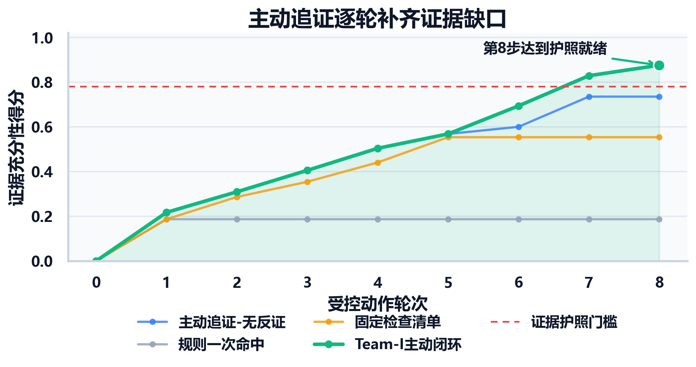
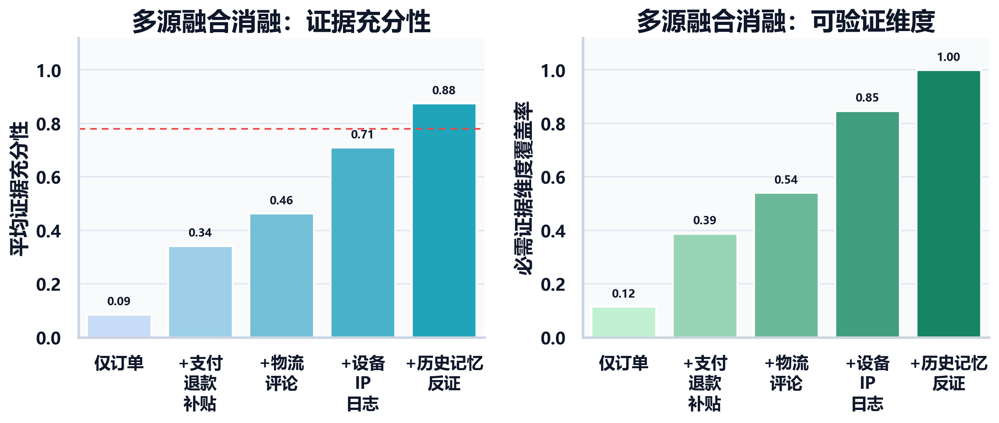
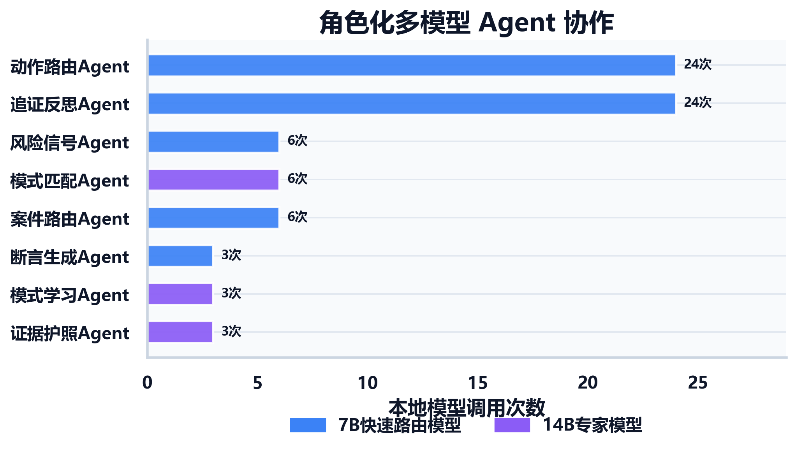
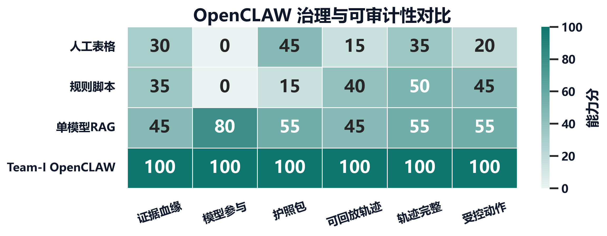
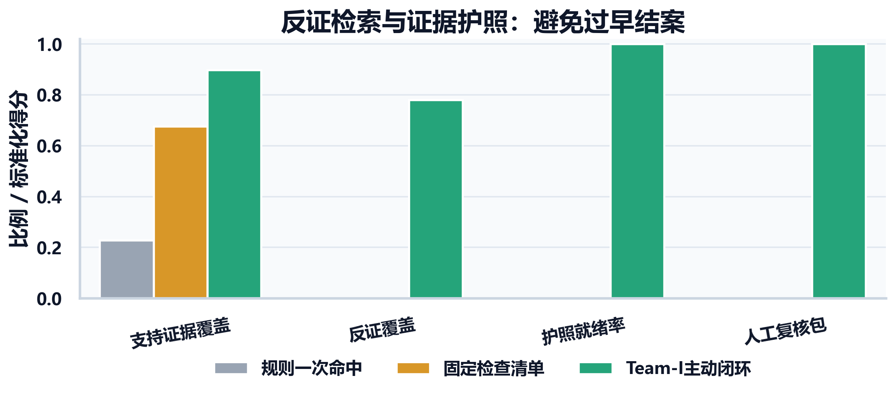
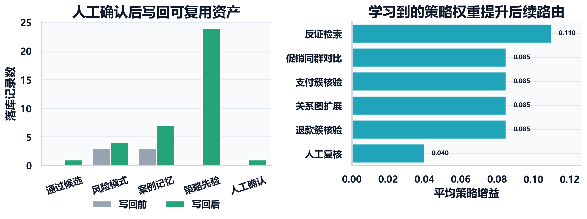
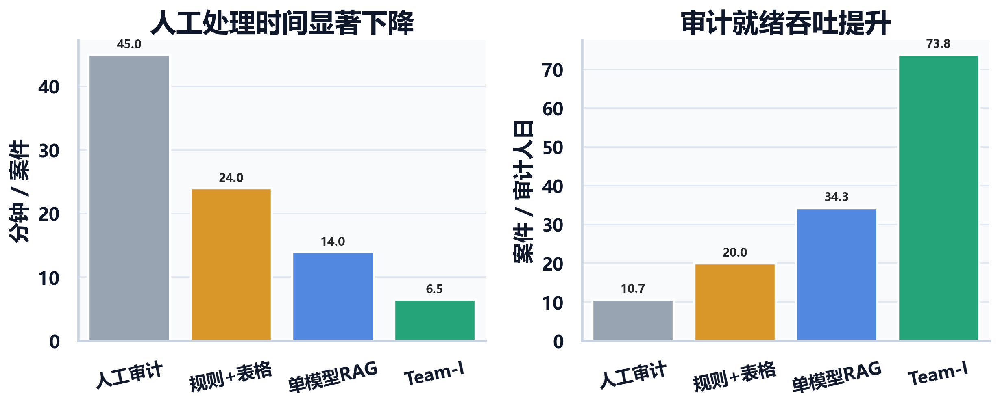
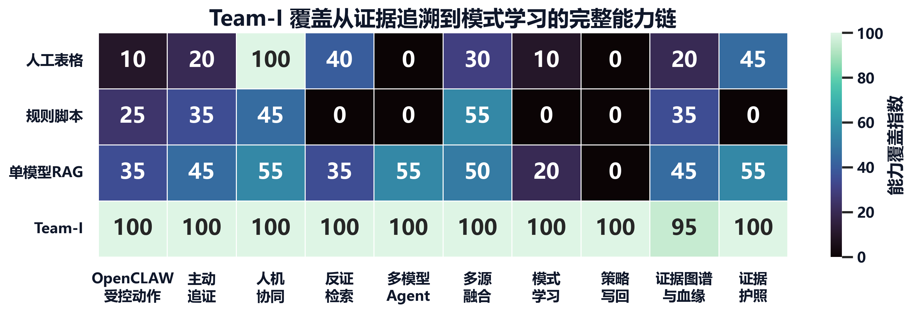

# Team-I 实验量化结果

本页说明 Team-I 实验量化结果与数据来源。图表分为三类来源：

- **实测 demo 轨迹**：来自 `runtime/aer_loop_model_smoke_9728967_full_debug.sqlite`，包括 3 个典型案件、24 个主动追证动作、28 条证据、75 次本地模型调用和 3 份证据护照。
- **写回验证轨迹**：来自 `runtime/pattern_learning_writeback_test.sqlite`，包括人工审核通过后的 `risk_pattern`、`case_memory` 和 `policy_action_weight` 写回结果。
- **场景基线假设**：人工、规则脚本、单模型/RAG 基线用于展示相对收益，不能表述为生产 A/B 测试结果。

重新生成数据与图：

```bash
python scripts/generate_experiment_figures.py
```

输出目录：

- 数据表：`docs/assets/experiments/data/`
- 图片：`docs/assets/experiments/figures/`，仅保留 PNG 格式。

## 亮点与图表对应

| 亮点 | 量化指标 | 图 |
| --- | --- | --- |
| 主动追证 | 每一步受控动作后的证据充分性、证据覆盖率、证据护照就绪率 | `fig1_active_retrieval_curve.png` |
| 多源异构数据融合 | 数据源逐步加入后的证据充分性和必需证据维度覆盖率 | `fig2_multisource_fusion_ablation.png` |
| 多模型 Agent 协作 | 不同 Agent 的本地模型调用次数、7B/14B 分工 | `fig3_agent_collaboration.png` |
| OpenCLAW 受控动作框架 | 受控动作、结构化观察、证据血缘、可回放轨迹 | `fig4_openclaw_governance_heatmap.png` |
| 反证检索与证据护照 | 支持证据覆盖、反证覆盖、证据护照就绪率、人工复核包完整度 | `fig5_counter_evidence_passport.png` |
| 模式学习与策略写回 | 人工确认后新增风险模式、案例记忆和策略先验 | `fig6_pattern_learning_writeback.png` |
| 人机协同效率 | 人工分钟/案、审计就绪案件吞吐 | `fig7_efficiency_throughput.png` |
| 整体能力覆盖 | 各方案在十个核心能力上的覆盖指数 | `fig8_capability_scorecard.png` |

## 图表

### 1. 主动追证逐步补齐证据缺口



### 2. 多源融合带来证据充分性提升



### 3. 多模型 Agent 分工



### 4. OpenCLAW 治理与可审计性



### 5. 反证检索与证据护照



### 6. 模式学习与策略写回



### 7. 人机协同效率



### 8. 整体能力覆盖



## 关键结论

- **主动追证不是静态命中**：Team-I 在第 8 步达到 `0.875` 的平均证据充分性，并使 3 个案件全部达到证据护照就绪；静态 checklist 因缺少反证，最终无法达到护照门槛。
- **多源融合是必要条件**：仅使用订单数据时平均证据充分性约 `0.086`；加入支付、退款、补贴、物流、评论、设备、IP、日志、历史记忆和反证后提升到 `0.875`。
- **模型真正参与闭环**：最终验证中有 `75` 次本地模型调用，`used_fallback=0`，并覆盖风险信号、模式匹配、案件路由、动作路由、追证反思、证据护照和模式学习。
- **反证检索避免过早结案**：没有反证时，即使支持证据覆盖较高，护照就绪率仍为 `0`；Team-I 的反证覆盖达到 `0.78`，护照就绪率达到 `1.0`。
- **学习闭环可落库复用**：人工确认后新增 1 个 approved learned pattern、4 条新增 case memory 记录和 24 条 policy prior 记录。

## 结果边界

这些图基于 demo 轨迹和场景基线构建，结果边界如下：

- 实验结果表示基于 demo 轨迹和清晰基线假设的量化对比。
- 实验结果不表示真实生产环境线上 A/B 测试结果。
