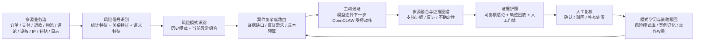
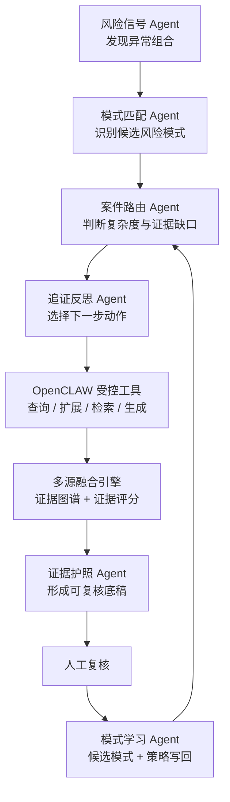

# Team-I 统一场景下的技术叙事

这份文档用于说明 Team-I 在统一跨境电商连续审计场景下的业务对象、典型案例、技术框架、Agent 协作、实验结果和代码实现。文档重点说明系统如何把“发现异常、主动追证、反证校验、证据护照、人工复核、模式学习、策略写回”落成一条完整技术闭环。

## 一个场景

统一场景设定为“跨境电商平台大促期间的连续审计”。平台正在进行新人补贴、跨境物流履约、商家评价增长和退款售后活动，业务数据实时流入审计系统。传统审计方式面对的是多个割裂问题：订单表能看到交易异常，支付表能看到账户集中，物流表能看到轨迹质量，评论表能看到文本相似，补贴台账能看到优惠消耗，但这些信息很难自然连成一条可解释、可复核、可沉淀的审计证据链。

Team-I 的设计是把这些风险都放在同一个连续审计场景里处理。系统不是把弱、中、强风险拆成三条独立处置线，而是让所有案件进入同一条主动追证主链路：先发现风险信号，再识别风险模式，再根据证据缺口选择下一步受控动作，持续补齐证据、搜索反证、生成证据护照，并在人工确认后把模式写回。

## 三个案例是一条风险链的三个切面

在这个统一场景下，三个案例不是彼此割裂的演示卡片，而是同一批跨境电商风险在不同业务环节上的表现。它们共享设备复用、支付聚类、促销人群异常、快速退款、物流真实性不足、历史模式相似等底层信号，但每个案例强调的业务外观不同。

| 案例 | 业务外观 | 技术能力 | 最关键的证据维度 |
| --- | --- | --- | --- |
| `AER-001 / EC-SKIM-001` | 团伙刷单骗补，一批新账号共享设备、IP、支付路径并集中消耗补贴 | 从多源异常出发，完成主动追证、反证检索和证据护照生成 | 设备复用、IP 聚类、支付聚类、退款异常、物流真实性、补贴滥用、评论相似、行为自动化 |
| `AER-002 / EC-FAKE-002` | 空包虚假交易和评价操纵，微订单、重复评论、低质量物流共同推高商家声誉 | 融合结构化交易、文本评论、物流轨迹和历史案例，形成跨源审计证据 | 评论相似、行为自动化、物流真实性、设备复用、IP 聚类、支付聚类、历史模式匹配 |
| `AER-003 / EC-ARBI-003` | 补贴套利观察，资格键、支付账户和退款行为集中，形成补贴抽取回路 | 将人工确认后的经验沉淀为模式库、案例记忆和策略权重 | 补贴滥用、退款异常、支付聚类、促销人群异常、历史模式匹配、反证检索 |

三个案例对应大促期间的三类风险外观，底层由同一套主动追证框架处理不同证据缺口。该设计避免将样例硬编码为孤立流程，使案件处理主链路能够复用于连续审计场景。

## 技术闭环如何解决这个场景

Team-I 的处理不是“规则命中后直接报警”，而是让 Agent 在 OpenCLAW 风格的受控动作空间里逐步补证。每一次动作都有结构化输入、结构化观察结果和轨迹记录，因此系统既能智能选择下一步，又能让审计人员回放每一步为什么做、查到了什么、证据来自哪里。

代码上，这条链路主要落在以下模块：`backend/aer_loop/orchestrator.py` 负责编排端到端闭环，`backend/aer_loop/agents/aer_agents.py` 定义多角色 Agent，`backend/aer_loop/tools/registry.py` 注册受控动作，`backend/aer_loop/fusion.py` 负责多源证据融合和图谱，`backend/aer_loop/policy.py` 负责下一步动作排序与策略权重读取，`backend/aer_loop/openclaw/spec.py` 定义 OpenCLAW 兼容契约。

## 三个案例的运行数据

最终本地模型验证使用 7B 和 14B 本地模型完成，`fallback` 调用为 0。验证摘要显示，三个案例共生成 28 条证据、75 条 Agent 轨迹、24 条案件动作线程和 3 个证据护照。

| 指标 | 结果 |
| --- | --- |
| 验证数据库 | `runtime/aer_loop_model_smoke_9728967_full_debug.sqlite` |
| 案件数 | 3 |
| 证据行数 | 28 |
| Agent 轨迹行数 | 75 |
| 案件动作线程 | 24 |
| 证据护照 | 3 |
| 本地模型调用 | 75 |
| fallback 调用 | 0 |

三个案例内部的数据也体现了同一条主链路的复用。`AER-001` 生成 10 条证据，覆盖 10 个证据维度；`AER-002` 生成 9 条证据，突出评论、物流和历史模式；`AER-003` 生成 9 条证据，突出补贴、退款和策略写回。每个案例都包含 `seek_counter_evidence` 动作，并都进入证据护照和人工复核门禁，而不是只给出单边风险判断。

| 案例 | 证据数 | 支持证据 | 不确定性 / 反证相关证据 | 受控动作数 | Agent 轨迹数 |
| --- | ---: | ---: | ---: | ---: | ---: |
| `AER-001` | 10 | 9 | 1 | 8 | 24 |
| `AER-002` | 9 | 8 | 1 | 8 | 24 |
| `AER-003` | 9 | 8 | 1 | 8 | 24 |

这些数字说明，三个案例不是静态页面展示，而是被同一套 Agent 轨迹和受控动作执行过的可回放样例。差异在于每个案例的证据缺口不同，因此主动追证动作的排序和重点不同。

## Agent 与模型分工

Team-I 采用多模型 Agent 分工，而不是把所有任务压给一个模型。7B 模型负责高频、低延迟的风险信号、案件路由、动作路由和追证反思；14B 模型负责更需要归纳、解释和稳健表达的模式匹配、证据护照和模式学习。

| Agent | 模型分工 | 最终验证调用次数 | 在统一场景中的作用 |
| --- | --- | ---: | --- |
| 风险信号 Agent | 7B | 6 | 从实时订单流和多源特征中发现异常组合 |
| 案件路由 Agent | 7B | 6 | 判断案件复杂度、证据缺口和下一阶段处理方向 |
| 动作路由 Agent | 7B | 24 | 根据当前证据状态选择下一步受控动作 |
| 追证反思 Agent | 7B | 24 | 执行查询、扩展、反证检索后的观察和迭代 |
| 断言生成 Agent | 7B | 3 | 把异常组合转化为可审计的风险断言 |
| 模式匹配 Agent | 14B | 6 | 将当前案件与历史风险模式、案例记忆进行匹配 |
| 证据护照 Agent | 14B | 3 | 汇总支持证据、反证、不确定性和复核门禁 |
| 模式学习 Agent | 14B | 3 | 从已处理轨迹中归纳候选风险模式和写回策略 |

该图展示多模型智能体协作的实际调用分布。最终轨迹中，高频动作路由和追证由 7B 承担，低频但更重推理的模式匹配、证据护照和模式学习由 14B 承担，形成成本和能力的分层。

## 主动追证如何体现智能过程

主动追证的核心不是多查几张表，而是让模型根据当前证据状态判断下一步最有价值的动作。比如在 `AER-001` 中，系统不是发现设备复用后直接结案，而是继续扩展 IP 和设备图、查询退款簇、支付簇、物流轨迹、促销人群，并主动搜索是否存在家庭共享设备、校园 IP、仓库批量发货、自然促销流量等反证。

这张图说明，规则一次命中容易停在局部证据，固定检查清单也很难根据案件状态改变顺序。Team-I 在每一轮追证后重新评估证据缺口，直到证据充分性跨过护照门槛。

在代码层面，主动追证由 `policy.py` 和 `orchestrator.py` 共同完成：`policy.py` 计算候选动作排序，`orchestrator.py` 调用 Agent 决策并执行工具，动作结果再进入融合引擎，影响下一轮路由。

## 多源异构融合如何支撑审计判断

三个案例共享同一套多源融合框架。系统把订单、支付、退款、物流、评论、设备、IP、补贴和历史记忆转成统一的证据对象，再通过图节点和边表达实体关系、证据来源和置信度。这样做的意义是把“业务异常”变成“审计证据链”，而不只是把多个指标堆在页面上。

这张图说明，单看订单时，证据充分性和可验证维度都很低；加入支付、退款、补贴、物流、评论后，系统开始形成跨源解释；加入设备、IP、日志和历史反证后，证据链才具备审计复核需要的完整性。

三个案例在证据维度上的差异，也正好体现多源融合的必要性。`AER-001` 更依赖设备、IP、支付、退款和补贴；`AER-002` 更依赖评论相似、微订单、物流真实性和历史案例；`AER-003` 更依赖补贴资格、支付聚类、退款链路和促销人群异常。它们不是三套系统，而是一套融合框架处理不同证据组合。

## OpenCLAW 受控动作如何保证可治理

Team-I 的 Agent 不是任意调用工具，而是在 OpenCLAW 风格的动作空间里执行。每个 action 都有明确的动作名、参数、观察结果和轨迹记录。例如 `expand_infra_graph` 负责扩展设备和 IP 关系，`query_refund_cluster` 负责查询退款异常，`query_payment_cluster` 负责支付路径聚类，`query_logistics_trace` 负责物流真实性，`compare_promo_cohort` 负责促销人群对照，`seek_counter_evidence` 负责主动反证检索。

该图对比 Team-I 与普通 RAG、规则系统在治理和可审计性上的差异。普通系统可能给出结论，但很难完整回答“模型为什么查这个、查了什么、证据从哪里来、下一步为什么继续查、人工如何复核”。OpenCLAW 受控动作让这些问题都有结构化记录。

## 反证检索与证据护照

审计场景不能只证明“像风险”，还要证明“有没有合理解释”。因此 Team-I 把反证检索作为必经动作。系统会主动检查家庭共享设备、校园或办公网络、仓库批量发货、自然促销流量、正常售后政策等解释是否存在，并把反证、不确定性和支持证据一起放入证据护照。

这张图说明，Team-I 不以单边风险证据直接结束流程。证据护照只有在支持证据、反证覆盖、不确定性记录和人工复核门禁都达到要求时才生成。该机制将 AI 判断转化为可复核底稿，增强审计结论的可解释性和可治理性。

## 人机协同与模式学习写回

三个案例处理完成后，系统会把轨迹交给人工复核。人工确认不是流程终点，而是模式学习的触发器。写回验证数据库 `runtime/pattern_learning_writeback_test.sqlite` 中，人工审核通过了一个由三个案例共同支持的候选模式 `CAND-2026-AER-001-AER-002-AER-003`。该模式被写入风险模式库，并同步写入案例记忆和策略权重。

| 写回对象 | 写回结果 |
| --- | --- |
| 人工审核 | 1 条已批准记录 |
| 风险模式库 | 从 3 个初始模式扩展为 4 个模式 |
| 策略权重 | 24 条动作权重写回记录 |
| 案例记忆 | 从 3 条历史记忆扩展为 7 条记忆 |
| 最大策略增益 | `seek_counter_evidence` 增益 0.110 |
| 主要动作增益 | `compare_promo_cohort`、`expand_infra_graph`、`query_payment_cluster`、`query_refund_cluster` 各增益 0.085 |

这张图展示模式学习与策略写回结果。Team-I 不只是把三个案例处理完，而是从三个案例中归纳出共同信号：设备复用、24 小时内退款、支付聚类、促销人群异常，并把这些经验写回下一轮追证策略。这样，系统具备从“单次审计”走向“持续进化连续审计”的能力。

## 实验结果如何支撑亮点

实验图用于统一场景下的能力验证。下面这张能力图把人工、规则、单模型 RAG 和 Team-I 放在同一能力链上比较。

人工方式擅长最终判断，但无法高效处理多源实时流和大量追证动作。规则方式能稳定命中已知模式，但缺少反证检索、模型参与和学习写回。单模型 RAG 能解释部分文本和案例，但动作治理、证据血缘、策略写回和人机闭环不足。Team-I 的优势是把 OpenCLAW 受控动作、多模型 Agent、主动追证、多源融合、证据护照、人机协同和模式学习放在同一条链路里。

该图量化人机协同的业务价值。系统先完成证据补齐、反证检索和护照生成，再把结构化复核包交给人工，减少审计人员反复查表、补证和整理底稿的时间。

## 亮点与证据对应关系

| 亮点关键词 | 在统一场景中的含义 | 可展示证据 |
| --- | --- | --- |
| OpenCLAW 受控动作框架 | Agent 只能通过注册动作追证，每次动作可回放、可审计 | `trajectory` 75 行、`case_thread` 24 行、图 4 |
| 多模型 Agent 协作 | 7B 做高频路由和追证，14B 做模式匹配、护照和学习 | 本地模型调用 75 次、fallback 0、图 3 |
| 主动追证 | 根据证据缺口动态选择下一步动作，而不是一次性规则命中 | 每案 8 个受控动作、图 1 |
| 多源异构数据融合 | 订单、支付、退款、物流、评论、设备、IP、补贴、日志进入统一证据对象 | 28 条证据、图 2 |
| 证据图谱 | 把实体、断言、证据和关系组织成可解释结构 | `evidence_graph_node`、`evidence_graph_edge` |
| 反证检索 | 主动寻找正常解释，避免单边证据和过早结案 | 每案包含 `seek_counter_evidence`，图 5 |
| 证据护照 | 将支持证据、反证、不确定性和人工门禁打包成复核底稿 | 3 个 passport，图 5 |
| 人机协同 | 系统先补证和整理，人工负责最终审核和处置确认 | 图 7 |
| 模式学习 | 从三案共同信号归纳候选模式 | `CAND-2026-AER-001-AER-002-AER-003`，图 6 |
| 策略写回 | 人工确认后更新模式库、案例记忆和动作权重 | 24 条 `policy_action_weight`，7 条 `case_memory`，图 6 |
